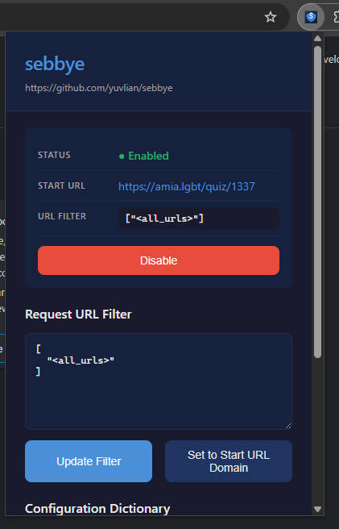
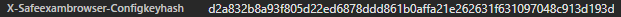

# sebbye

a seb "bypasser" chrome extension





## setup

1. run these
    ```bash
    git clone https://github.com/yuvlian/sebbye.git
    cd sebbye
    npm install
    npm run build
    ```
2. open `chrome://extensions` on ur browser.
3. enable developer mode and click load unpacked.
4. select the `dist` dir from build result
